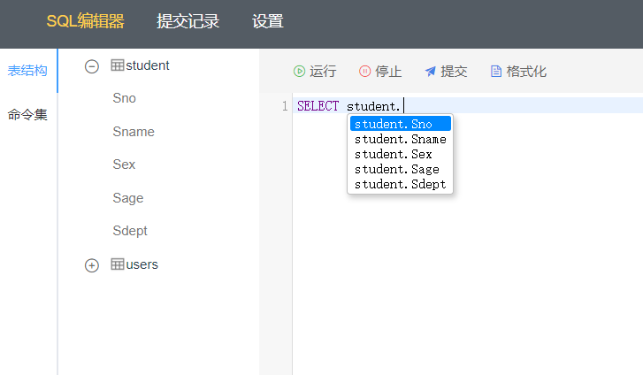

## 项目介绍

本项目是基于 Vue2 + Codemirror 开发的 Web 版 SQL 编辑器，提供了以下功能：

- 在线运行 SQL 语句
- 实时命令提示（支持表名、字段名、SQL关键词提示）
- 查看 SQL 执行结果
- 提交 SQL 命令集
- 快捷使用命令集
- SQL 语句格式化
- SQL code differ
- 动态设置编辑器配置项
- 实时查看表结构

> 说明：本项目仅供学习研究使用！
>

## 项目使用

clone项目后在项目根目录下安装依赖
```shell
npm install
```

执行启动命令
```shell
npm run serve
```

本项目提供了配套的后端示例代码（基于 Node + Express 实现），地址：
https://gitee.com/web1024cn/sqleditor-server

## 效果演示

编辑器效果：


展示查询结果：


实时表名、字段名、关键词提示：



SQL执行异常提示：


查看命令保存记录：


保存命令的 code differ 查看：


动态设置编辑器配置项：


快捷使用命令集：


## 代码介绍

- 项目中使用了 codemirror@5.65.2 实现编辑器功能
- 使用 axios 实现 HTTP 请求，在 vue.config.js 中配置了 webpack-server 的代理解决跨域问题
- 封装 axios 请求模块，规范 API 格式
- 使用 vuex modules 和 vuex-persistedstate 实现前端数据缓存